# Design Document: Android Custom Dialer with Call Recording

## Overview

This design document outlines the technical architecture for implementing a custom Android dialer with reliable call recording within the existing Education CRM React Native application. The solution leverages Android's Telecom API to handle outgoing calls through the app's own calling infrastructure, enabling automatic call recording when calls become active.

## Architecture

### High-Level Architecture

```
┌─────────────────────────────────────────────────────────────────────┐
│                     React Native Layer                               │
│  ┌─────────────┐  ┌─────────────┐  ┌─────────────────────────────┐  │
│  │ LeadDetail  │  │ CallHelper  │  │ RecordingUploadService      │  │
│  │   Screen    │──│  (Updated)  │──│      (Existing)             │  │
│  └─────────────┘  └─────────────┘  └─────────────────────────────┘  │
│         │                │                       ▲                   │
│         ▼                ▼                       │                   │
│  ┌─────────────────────────────────────────────────────────────┐    │
│  │              DialerBridgeModule (Native Module)              │    │
│  │   - makeCall(phoneNumber, leadId)                           │    │
│  │   - requestDefaultDialer()                                   │    │
│  │   - isDefaultDialer()                                        │    │
│  │   - Events: CALL_*, RECORDING_*                              │    │
│  └─────────────────────────────────────────────────────────────┘    │
└─────────────────────────────────────────────────────────────────────┘
                                    │
                    ┌───────────────┴───────────────┐
                    ▼                               ▼
┌─────────────────────────────────┐  ┌─────────────────────────────────┐
│     Android Native Layer        │  │      Android System Layer        │
│  ┌───────────────────────────┐  │  │  ┌───────────────────────────┐  │
│  │   CrmConnectionService    │◄─┼──┼──│     TelecomManager        │  │
│  │   (extends Connection     │  │  │  └───────────────────────────┘  │
│  │    Service)               │  │  │  ┌───────────────────────────┐  │
│  └───────────────────────────┘  │  │  │     Telephony System      │  │
│  ┌───────────────────────────┐  │  │  └───────────────────────────┘  │
│  │   CrmInCallService        │  │  └─────────────────────────────────┘
│  │   (extends InCallService) │  │
│  └───────────────────────────┘  │
│  ┌───────────────────────────┐  │
│  │   CallRecordingService    │  │
│  │   (Foreground Service)    │  │
│  └───────────────────────────┘  │
│  ┌───────────────────────────┐  │
│  │   InCallActivity          │  │
│  │   (Custom Call UI)        │  │
│  └───────────────────────────┘  │
└─────────────────────────────────┘
```

### Call Flow Sequence

```mermaid
sequenceDiagram
    participant RN as React Native
    participant Bridge as DialerBridgeModule
    participant TM as TelecomManager
    participant CS as CrmConnectionService
    participant RS as CallRecordingService
    participant UI as InCallActivity

    RN->>Bridge: makeCall(phoneNumber, leadId)
    Bridge->>TM: placeCall(uri, extras)
    TM->>CS: onCreateOutgoingConnection()
    CS->>CS: Create CrmConnection
    CS-->>Bridge: emit CALL_STARTED
    CS->>TM: setDialing()
    
    Note over CS: Remote party answers
    CS->>CS: setActive()
    CS-->>Bridge: emit CALL_CONNECTED
    CS->>RS: startRecording()
    RS->>RS: Start MediaRecorder
    RS-->>Bridge: emit RECORDING_STARTED
    RS->>UI: Show recording indicator
    
    Note over UI: User ends call
    UI->>CS: disconnect()
    CS->>RS: stopRecording()
    RS->>RS: Finalize recording file
    RS-->>Bridge: emit RECORDING_STOPPED
    CS->>TM: setDisconnected()
    CS-->>Bridge: emit CALL_ENDED
    Bridge->>RN: Upload recording
```



## Components and Interfaces

### 1. DialerBridgeModule (Kotlin)

The React Native native module that bridges JavaScript and Android native code.

```kotlin
// Location: android/app/src/main/java/com/educationcrm/dialer/DialerBridgeModule.kt

interface DialerBridgeInterface {
    // Methods exposed to React Native
    fun makeCall(phoneNumber: String, leadId: String, promise: Promise)
    fun requestDefaultDialer(promise: Promise)
    fun isDefaultDialer(promise: Promise)
    fun endCurrentCall(promise: Promise)
    fun toggleMute(promise: Promise)
    fun toggleSpeaker(promise: Promise)
    
    // Events emitted to React Native
    // - CALL_STARTED: { callId, phoneNumber, leadId }
    // - CALL_CONNECTED: { callId, phoneNumber }
    // - CALL_ENDED: { callId, phoneNumber, duration }
    // - RECORDING_STARTED: { callId }
    // - RECORDING_STOPPED: { callId, filePath, duration, fileSize }
    // - RECORDING_ERROR: { callId, error }
}
```

### 2. CrmConnectionService (Kotlin)

Handles the telephony connection lifecycle.

```kotlin
// Location: android/app/src/main/java/com/educationcrm/dialer/CrmConnectionService.kt

class CrmConnectionService : ConnectionService() {
    
    override fun onCreateOutgoingConnection(
        connectionManagerPhoneAccount: PhoneAccountHandle?,
        request: ConnectionRequest?
    ): Connection {
        // Create and return CrmConnection
    }
    
    override fun onCreateOutgoingConnectionFailed(
        connectionManagerPhoneAccount: PhoneAccountHandle?,
        request: ConnectionRequest?
    ) {
        // Handle connection failure
    }
}

class CrmConnection(
    private val phoneNumber: String,
    private val leadId: String
) : Connection() {
    
    override fun onStateChanged(state: Int) {
        when (state) {
            STATE_DIALING -> notifyDialing()
            STATE_ACTIVE -> {
                notifyActive()
                startRecording()
            }
            STATE_DISCONNECTED -> {
                stopRecording()
                notifyDisconnected()
            }
        }
    }
    
    override fun onDisconnect() {
        setDisconnected(DisconnectCause(DisconnectCause.LOCAL))
        destroy()
    }
    
    override fun onAbort() {
        setDisconnected(DisconnectCause(DisconnectCause.CANCELED))
        destroy()
    }
}
```

### 3. CallRecordingService (Kotlin)

Foreground service that handles audio recording.

```kotlin
// Location: android/app/src/main/java/com/educationcrm/dialer/CallRecordingService.kt

class CallRecordingService : Service() {
    private var mediaRecorder: MediaRecorder? = null
    private var outputFile: File? = null
    private var startTime: Long = 0
    
    fun startRecording(callId: String, phoneNumber: String): Boolean {
        outputFile = createOutputFile(callId, phoneNumber)
        
        mediaRecorder = MediaRecorder().apply {
            setAudioSource(MediaRecorder.AudioSource.VOICE_RECOGNITION)
            setOutputFormat(MediaRecorder.OutputFormat.MPEG_4)
            setAudioEncoder(MediaRecorder.AudioEncoder.AAC)
            setAudioSamplingRate(44100)
            setAudioEncodingBitRate(128000)
            setOutputFile(outputFile?.absolutePath)
            
            if (Build.VERSION.SDK_INT >= Build.VERSION_CODES.R) {
                setPrivacySensitive(false)
            }
            
            prepare()
            start()
        }
        
        startTime = System.currentTimeMillis()
        return true
    }
    
    fun stopRecording(): RecordingResult {
        val duration = System.currentTimeMillis() - startTime
        
        mediaRecorder?.apply {
            stop()
            release()
        }
        mediaRecorder = null
        
        return RecordingResult(
            filePath = outputFile?.absolutePath ?: "",
            duration = duration,
            fileSize = outputFile?.length() ?: 0
        )
    }
    
    private fun createOutputFile(callId: String, phoneNumber: String): File {
        val timestamp = System.currentTimeMillis()
        val sanitizedPhone = phoneNumber.replace(Regex("[^0-9]"), "")
        val fileName = "call_${timestamp}_${sanitizedPhone}.m4a"
        return File(applicationContext.filesDir, "recordings/$fileName")
    }
}
```

### 4. InCallActivity (Kotlin)

Custom in-call UI displayed during active calls.

```kotlin
// Location: android/app/src/main/java/com/educationcrm/dialer/InCallActivity.kt

class InCallActivity : AppCompatActivity() {
    private lateinit var binding: ActivityInCallBinding
    private var callDurationTimer: Timer? = null
    
    // UI Elements:
    // - Phone number display
    // - Call duration timer
    // - Recording indicator (red dot + "Recording")
    // - Mute button
    // - Speaker button  
    // - End call button
    
    override fun onCreate(savedInstanceState: Bundle?) {
        super.onCreate(savedInstanceState)
        binding = ActivityInCallBinding.inflate(layoutInflater)
        setContentView(binding.root)
        
        setupCallControls()
        startDurationTimer()
    }
    
    private fun setupCallControls() {
        binding.btnEndCall.setOnClickListener {
            CallManager.endCurrentCall()
            finish()
        }
        
        binding.btnMute.setOnClickListener {
            CallManager.toggleMute()
            updateMuteButton()
        }
        
        binding.btnSpeaker.setOnClickListener {
            CallManager.toggleSpeaker()
            updateSpeakerButton()
        }
    }
}
```

### 5. PhoneAccountManager (Kotlin)

Manages PhoneAccount registration with TelecomManager.

```kotlin
// Location: android/app/src/main/java/com/educationcrm/dialer/PhoneAccountManager.kt

object PhoneAccountManager {
    private const val PHONE_ACCOUNT_ID = "crm_dialer_account"
    
    fun registerPhoneAccount(context: Context): PhoneAccountHandle {
        val telecomManager = context.getSystemService(Context.TELECOM_SERVICE) as TelecomManager
        val componentName = ComponentName(context, CrmConnectionService::class.java)
        val phoneAccountHandle = PhoneAccountHandle(componentName, PHONE_ACCOUNT_ID)
        
        val phoneAccount = PhoneAccount.builder(phoneAccountHandle, "CRM Dialer")
            .setCapabilities(
                PhoneAccount.CAPABILITY_CALL_PROVIDER or
                PhoneAccount.CAPABILITY_SELF_MANAGED
            )
            .addSupportedUriScheme(PhoneAccount.SCHEME_TEL)
            .build()
        
        telecomManager.registerPhoneAccount(phoneAccount)
        return phoneAccountHandle
    }
    
    fun isDefaultDialer(context: Context): Boolean {
        val telecomManager = context.getSystemService(Context.TELECOM_SERVICE) as TelecomManager
        return telecomManager.defaultDialerPackage == context.packageName
    }
    
    fun requestDefaultDialer(activity: Activity) {
        val intent = Intent(TelecomManager.ACTION_CHANGE_DEFAULT_DIALER)
            .putExtra(TelecomManager.EXTRA_CHANGE_DEFAULT_DIALER_PACKAGE_NAME, activity.packageName)
        activity.startActivityForResult(intent, REQUEST_DEFAULT_DIALER)
    }
}
```

## Data Models

### CallState (Kotlin)

```kotlin
data class CallState(
    val callId: String,
    val phoneNumber: String,
    val leadId: String,
    val state: CallStateEnum,
    val startTime: Long,
    val connectTime: Long?,
    val endTime: Long?,
    val isRecording: Boolean,
    val isMuted: Boolean,
    val isSpeakerOn: Boolean
)

enum class CallStateEnum {
    IDLE,
    DIALING,
    RINGING,
    ACTIVE,
    HOLDING,
    DISCONNECTED
}
```

### RecordingResult (Kotlin)

```kotlin
data class RecordingResult(
    val callId: String,
    val filePath: String,
    val duration: Long,      // milliseconds
    val fileSize: Long,      // bytes
    val phoneNumber: String,
    val leadId: String,
    val timestamp: Long
)
```

### React Native Event Payloads (TypeScript)

```typescript
// Location: src/types/DialerTypes.ts

interface CallStartedEvent {
  callId: string;
  phoneNumber: string;
  leadId: string;
  timestamp: number;
}

interface CallConnectedEvent {
  callId: string;
  phoneNumber: string;
  timestamp: number;
}

interface CallEndedEvent {
  callId: string;
  phoneNumber: string;
  duration: number;  // seconds
  timestamp: number;
}

interface RecordingStoppedEvent {
  callId: string;
  filePath: string;
  duration: number;  // seconds
  fileSize: number;  // bytes
  leadId: string;
}

interface RecordingErrorEvent {
  callId: string;
  error: string;
  code: string;
}
```

## Error Handling

### Error Categories and Responses

| Error Type | Detection | Response |
|------------|-----------|----------|
| Permission Denied | Runtime permission check | Show rationale dialog, disable feature |
| MediaRecorder Init Failed | try-catch in startRecording() | Log error, emit RECORDING_ERROR, continue call |
| Connection Failed | onCreateOutgoingConnectionFailed() | Emit error event, show user message |
| Low Storage | Check before recording | Warn user, optionally skip recording |
| Service Crash | Service restart mechanism | Auto-restart within 3 seconds |
| Upload Failed | HTTP error response | Retry with exponential backoff |

### Error Codes

```kotlin
object DialerErrorCodes {
    const val PERMISSION_DENIED = "PERMISSION_DENIED"
    const val NOT_DEFAULT_DIALER = "NOT_DEFAULT_DIALER"
    const val INVALID_PHONE_NUMBER = "INVALID_PHONE_NUMBER"
    const val CONNECTION_FAILED = "CONNECTION_FAILED"
    const val RECORDING_INIT_FAILED = "RECORDING_INIT_FAILED"
    const val RECORDING_STOPPED_UNEXPECTEDLY = "RECORDING_STOPPED_UNEXPECTEDLY"
    const val LOW_STORAGE = "LOW_STORAGE"
    const val UPLOAD_FAILED = "UPLOAD_FAILED"
}
```

## Testing Strategy

### Unit Tests

1. **PhoneAccountManager Tests**
   - Test PhoneAccount registration
   - Test default dialer detection
   - Test permission checks

2. **CallRecordingService Tests**
   - Test MediaRecorder configuration
   - Test file naming convention
   - Test recording start/stop lifecycle

3. **DialerBridgeModule Tests**
   - Test phone number validation
   - Test event emission
   - Test promise resolution/rejection

### Integration Tests

1. **Call Flow Tests**
   - Test complete outgoing call flow
   - Test call state transitions
   - Test recording triggers

2. **React Native Bridge Tests**
   - Test makeCall from JavaScript
   - Test event reception in JavaScript
   - Test error handling across bridge

### Manual Testing Checklist

- [ ] Set app as default dialer
- [ ] Make outgoing call from lead screen
- [ ] Verify in-call UI displays correctly
- [ ] Verify recording starts when call connects
- [ ] Verify recording stops when call ends
- [ ] Verify recording uploads successfully
- [ ] Verify recording appears in lead detail
- [ ] Test mute/speaker/end call buttons
- [ ] Test app backgrounding during call
- [ ] Test low storage warning
- [ ] Test permission denial scenarios

## File Structure

```
android/app/src/main/java/com/educationcrm/
├── MainApplication.kt (existing - add DialerPackage to packages list)
├── MainActivity.kt (existing - add dialer intent filters)
├── AudioRecorderModule.kt (existing - reuse for recording)
├── AudioRecorderPackage.kt (existing)
├── AccessibilityModule.kt (existing)
├── AccessibilityPackage.kt (existing)
├── CallRecordingAccessibilityService.kt (existing - fallback mode)
├── RecordingService.kt (existing - reuse for recording)
└── dialer/
    ├── DialerPackage.kt           # React Native package registration
    ├── DialerBridgeModule.kt      # Native module for RN bridge
    ├── CrmConnectionService.kt    # ConnectionService implementation
    ├── CrmConnection.kt           # Connection implementation
    ├── CrmInCallService.kt        # InCallService implementation
    ├── DialerRecordingService.kt  # Foreground service for dialer recording
    ├── InCallActivity.kt          # Custom in-call UI
    ├── PhoneAccountManager.kt     # PhoneAccount registration
    ├── CallManager.kt             # Singleton for call state management
    ├── PermissionHelper.kt        # Permission request utilities
    └── models/
        ├── CallState.kt
        └── RecordingResult.kt

android/app/src/main/res/
├── layout/
│   └── activity_in_call.xml      # In-call UI layout
├── drawable/
│   ├── ic_call_end.xml
│   ├── ic_mic.xml
│   ├── ic_mic_off.xml
│   ├── ic_speaker.xml
│   └── ic_recording.xml
└── values/
    └── strings.xml (add dialer strings)

src/
├── services/
│   ├── DialerService.ts          # TypeScript wrapper for native module
│   ├── RecordingService.ts       # (existing - no changes needed)
│   ├── RecordingUploadService.ts # (existing - add uploadDialerRecording method)
│   └── AudioPlayerService.ts     # (existing - no changes needed)
├── managers/
│   └── CallRecordingManager.ts   # (existing - update for dialer integration)
├── utils/
│   └── CallHelper.ts             # (existing - update for dialer integration)
├── components/
│   └── RecordingList.tsx         # (existing - no changes needed)
├── screens/
│   └── LeadDetailScreen.tsx      # (existing - add dialer event handling)
└── types/
    └── DialerTypes.ts            # TypeScript interfaces
```

## Existing Code Integration Points

### 1. MainApplication.kt (Existing)
The app already registers native packages. We add DialerPackage to the existing list:
```kotlin
// Current packages in MainApplication.kt:
// - AudioRecorderPackage()
// - AccessibilityPackage()
// Add:
// - DialerPackage()
```

### 2. CallRecordingManager.ts (Existing)
The existing manager handles:
- Permission checking via PermissionService
- Call initiation via CallHelper
- Recording via RecordingService (uses AudioRecorderModule)
- Upload via RecordingUploadService
- Accessibility service fallback mode

**Integration Strategy:**
```typescript
// In handleCallWithRecording():
async handleCallWithRecording(leadId: string, phoneNumber: string, autoRecord: boolean = true) {
  // NEW: Check if app is default dialer first
  const isDefaultDialer = await DialerService.isDefaultDialer();
  
  if (isDefaultDialer) {
    // Use native dialer with automatic recording
    await DialerService.makeCall(phoneNumber, leadId);
    // Recording is handled automatically by native ConnectionService
  } else {
    // Existing flow: CallHelper + manual/accessibility recording
    await CallHelper.initiateCall(phoneNumber);
    // ... existing recording logic
  }
}
```

### 3. RecordingUploadService.ts (Existing)
Already handles:
- S3 presigned URL uploads
- Chunked upload fallback
- Retry queue with exponential backoff
- Network state monitoring

**Integration Strategy:**
Add `uploadDialerRecording()` method that accepts native file path:
```typescript
async uploadDialerRecording(event: RecordingStoppedEvent): Promise<UploadResult> {
  // Reuse existing uploadRecording() with file path from native
  return this.uploadRecording({
    filePath: event.filePath,
    leadId: event.leadId,
    callLogId: event.callId,
  });
}
```

### 4. RecordingList.tsx (Existing)
Already displays recordings from `call_logs` with `recording_path`. No changes needed - dialer recordings will use the same data structure.

### 5. LeadDetailScreen.tsx (Existing)
Already has:
- Recording state management
- Upload progress display
- Recording completion listeners

**Integration Strategy:**
Add dialer event subscription in useEffect:
```typescript
useEffect(() => {
  const subscription = DialerService.addListener('RECORDING_STOPPED', async (event) => {
    await RecordingUploadService.uploadDialerRecording(event);
    fetchLeadDetails(); // Refresh to show new recording
  });
  return () => subscription.remove();
}, []);
```

## Backward Compatibility

The implementation ensures:
1. **Existing features continue working** - When not default dialer, existing CallHelper + accessibility service flow is used
2. **Graceful fallback** - If default dialer permission is revoked, app falls back to existing behavior
3. **Compatible data structures** - Dialer recordings use same format as existing recordings
4. **Shared services** - Reuses existing upload, playback, and cache services

## AndroidManifest.xml Changes

### Existing Permissions (Already Present)
```xml
<uses-permission android:name="android.permission.INTERNET" />
<uses-permission android:name="android.permission.CALL_PHONE" />
<uses-permission android:name="android.permission.READ_PHONE_STATE" />
<uses-permission android:name="android.permission.RECORD_AUDIO" />
<uses-permission android:name="android.permission.FOREGROUND_SERVICE" />
<uses-permission android:name="android.permission.FOREGROUND_SERVICE_MICROPHONE" />
<uses-permission android:name="android.permission.READ_CALL_LOG" />
```

### New Permissions to Add
```xml
<uses-permission android:name="android.permission.MANAGE_OWN_CALLS" />
<uses-permission android:name="android.permission.ANSWER_PHONE_CALLS" />
```

### Existing Services (Keep Unchanged)
```xml
<!-- Recording Service - already exists -->
<service 
    android:name=".RecordingService" 
    android:foregroundServiceType="microphone" 
    android:exported="false" />

<!-- Accessibility Service - already exists (fallback mode) -->
<service
    android:name=".CallRecordingAccessibilityService"
    android:permission="android.permission.BIND_ACCESSIBILITY_SERVICE"
    android:exported="false">
    ...
</service>
```

### New Services to Add
```xml
<!-- ConnectionService for Telecom API -->
<service
    android:name=".dialer.CrmConnectionService"
    android:permission="android.permission.BIND_TELECOM_CONNECTION_SERVICE"
    android:exported="true">
    <intent-filter>
        <action android:name="android.telecom.ConnectionService" />
    </intent-filter>
</service>

<!-- InCallService for default dialer UI -->
<service
    android:name=".dialer.CrmInCallService"
    android:permission="android.permission.BIND_INCALL_SERVICE"
    android:exported="true">
    <meta-data
        android:name="android.telecom.IN_CALL_SERVICE_UI"
        android:value="true" />
    <meta-data
        android:name="android.telecom.IN_CALL_SERVICE_RINGING"
        android:value="true" />
    <intent-filter>
        <action android:name="android.telecom.InCallService" />
    </intent-filter>
</service>

<!-- Dialer Recording Foreground Service -->
<service
    android:name=".dialer.DialerRecordingService"
    android:foregroundServiceType="microphone"
    android:exported="false" />
```

### New Activity to Add
```xml
<!-- In-Call Activity -->
<activity
    android:name=".dialer.InCallActivity"
    android:theme="@style/Theme.InCall"
    android:showOnLockScreen="true"
    android:turnScreenOn="true"
    android:exported="false" />
```

### Intent Filters to Add to MainActivity
```xml
<activity android:name=".MainActivity">
    <!-- Existing intent filters remain unchanged -->
    
    <!-- NEW: Dialer intent filters for default dialer capability -->
    <intent-filter>
        <action android:name="android.intent.action.DIAL" />
        <category android:name="android.intent.category.DEFAULT" />
    </intent-filter>
    <intent-filter>
        <action android:name="android.intent.action.DIAL" />
        <category android:name="android.intent.category.DEFAULT" />
        <data android:scheme="tel" />
    </intent-filter>
</activity>
```


## Integration Verification Checklist

### Pre-Implementation Verification
- [x] React Native version 0.82.1 - Compatible with native modules
- [x] Android compileSdkVersion 36 - Supports latest Telecom API
- [x] Android targetSdkVersion 36 - Supports latest Telecom API
- [x] Android minSdkVersion 24 - Supports Telecom API (requires API 23+)
- [x] Kotlin version 2.1.20 - Compatible with ConnectionService
- [x] Existing native modules (AudioRecorderPackage, AccessibilityPackage) - Will coexist with DialerPackage

### Existing Services Compatibility
| Service | Status | Notes |
|---------|--------|-------|
| RecordingService.kt | Keep unchanged | Used for manual/accessibility recording |
| CallRecordingAccessibilityService.kt | Keep unchanged | Fallback when not default dialer |
| AudioRecorderModule.kt | Keep unchanged | Used by RecordingService.ts |

### Existing TypeScript Services Compatibility
| Service | Status | Notes |
|---------|--------|-------|
| CallRecordingManager.ts | Update | Add dialer integration |
| RecordingUploadService.ts | Update | Add uploadDialerRecording() |
| RecordingService.ts | Keep unchanged | Works for manual recording |
| AudioPlayerService.ts | Keep unchanged | Works for all recordings |
| CallHelper.ts | Keep unchanged | Used when not default dialer |

### Data Flow Comparison

**Current Flow (Non-Default Dialer):**
```
LeadDetailScreen → CallRecordingManager → CallHelper → System Dialer
                                       → RecordingService → AudioRecorderModule
                                       → RecordingUploadService → S3
```

**New Flow (Default Dialer):**
```
LeadDetailScreen → CallRecordingManager → DialerService → DialerBridgeModule
                                                        → CrmConnectionService
                                                        → DialerRecordingService
                                       → RecordingUploadService → S3
```

### Recording File Compatibility
Both systems produce identical file format:
- Format: M4A (MPEG-4 Audio)
- Codec: AAC
- Sample Rate: 44100 Hz
- Bitrate: 128 kbps
- Naming: `call_{timestamp}_{phone}.m4a` or `recording_{timestamp}.m4a`
- Location: App's private files directory

### API Compatibility
Dialer recordings use the same backend API endpoints:
- `POST /leads/{leadId}/recordings/presign` - Get S3 presigned URL
- `POST /leads/{leadId}/recordings` - Attach recording to call log
- `GET /leads/{leadId}` - Returns call_logs with recording_path

### Rollback Plan
If integration fails:
1. Remove DialerPackage from MainApplication.kt
2. Revert AndroidManifest.xml changes (remove new services/permissions)
3. Remove dialer/ directory
4. Revert CallRecordingManager.ts changes
5. App returns to original functionality using accessibility service
