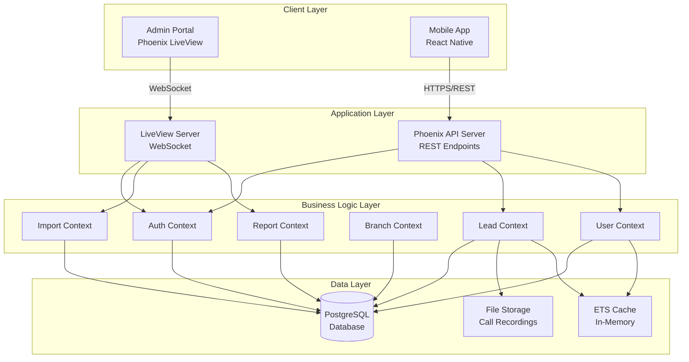
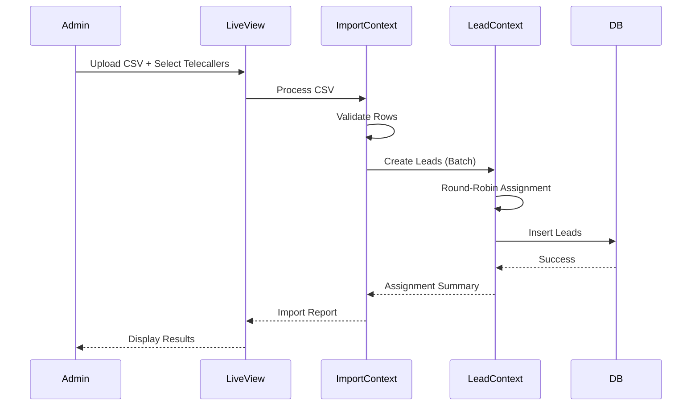
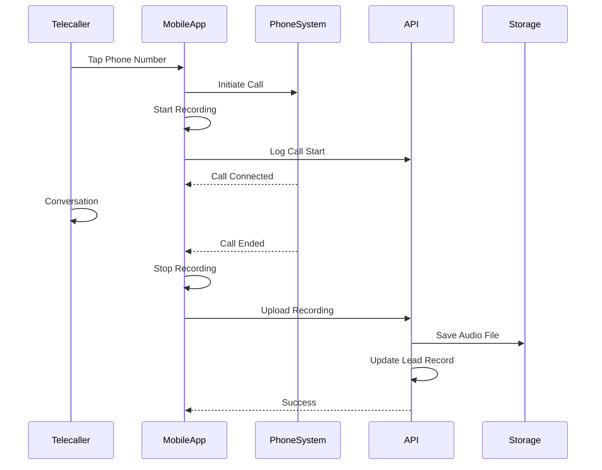

# Design Document

## Overview

The Education CRM is a hybrid application system consisting of three main components:

1. **Backend API** - Phoenix/Elixir REST API handling business logic, data persistence, and file storage
2. **Admin Portal** - Phoenix LiveView web application for system administration and data management
3. **Mobile App** - React Native Android application for telecallers with native phone integration

The system is designed to scale to 300+ concurrent users with a focus on simplicity, performance, and mobile-first telecaller experience.

### Technology Stack

- **Backend**: Elixir 1.15+, Phoenix 1.7+, PostgreSQL 15+
- **Admin Portal**: Phoenix LiveView, TailwindCSS
- **Mobile App**: React Native 0.72+, React Navigation, Axios
- **File Storage**: Local filesystem or S3-compatible storage for call recordings
- **Authentication**: JWT tokens with refresh token rotation
- **Caching**: ETS (Erlang Term Storage) for in-memory caching

## Architecture

### System Architecture Diagram



### Data Flow

#### CSV Import Flow


#### Call Recording Flow


## Components and Interfaces

### Backend API (Phoenix/Elixir)

#### Contexts (Business Logic Modules)

**1. Auth Context**
- `authenticate(username, password)` - Validates credentials, returns JWT
- `refresh_token(refresh_token)` - Issues new access token
- `revoke_token(token)` - Invalidates token
- `verify_token(token)` - Validates JWT and returns user

**2. User Context**
- `create_telecaller(attrs, branch_id)` - Creates telecaller account
- `list_telecallers(branch_id, filters)` - Returns telecallers with lead counts
- `deactivate_telecaller(id)` - Soft deletes telecaller
- `get_telecaller_stats(id, date_range)` - Returns performance metrics

**3. Branch Context**
- `create_branch(attrs)` - Creates branch record
- `update_branch(id, attrs)` - Updates branch details
- `deactivate_branch(id)` - Soft deletes branch
- `list_branches()` - Returns all active branches

**4. Lead Context**
- `create_lead(attrs, telecaller_id)` - Creates single lead
- `bulk_create_leads(leads_list, telecaller_ids)` - Batch insert with assignment
- `list_leads(telecaller_id, filters)` - Returns paginated leads
- `get_lead(id)` - Returns lead with full history
- `update_lead(id, attrs)` - Updates lead fields
- `add_note(lead_id, note, telecaller_id)` - Appends note to history
- `log_call(lead_id, attrs)` - Records call attempt
- `attach_recording(lead_id, file_path)` - Links audio file to lead

**5. Follow-up Context**
- `create_followup(lead_id, attrs)` - Schedules follow-up
- `list_due_followups(telecaller_id, date)` - Returns pending follow-ups
- `complete_followup(id)` - Marks follow-up done
- `get_upcoming_notifications()` - Returns follow-ups due in 24h

**6. Import Context**
- `parse_csv(file_path)` - Validates and parses CSV
- `distribute_leads(leads, telecaller_ids)` - Round-robin assignment
- `import_leads(csv_data, telecaller_ids, branch_id)` - Full import process

**7. Report Context**
- `telecaller_performance(filters)` - Aggregates call and conversion stats
- `branch_summary(branch_id, date_range)` - Branch-level metrics
- `export_report(report_data)` - Generates CSV export


#### REST API Endpoints

**Authentication**
- `POST /api/auth/login` - Login (returns JWT + refresh token)
- `POST /api/auth/refresh` - Refresh access token
- `POST /api/auth/logout` - Revoke tokens

**Leads** (Telecaller Access)
- `GET /api/leads` - List assigned leads (paginated, filtered)
- `GET /api/leads/:id` - Get lead details with history
- `PATCH /api/leads/:id` - Update lead (status, notes)
- `POST /api/leads/:id/calls` - Log call attempt
- `POST /api/leads/:id/recordings` - Upload call recording
- `GET /api/leads/:id/recordings/:recording_id` - Stream audio file

**Follow-ups** (Telecaller Access)
- `GET /api/followups` - List telecaller's follow-ups
- `POST /api/followups` - Create follow-up
- `PATCH /api/followups/:id` - Mark complete

**User Profile** (Telecaller Access)
- `GET /api/me` - Get current user profile
- `GET /api/me/stats` - Get personal performance stats

### Admin Portal (Phoenix LiveView)

#### LiveView Modules

**1. DashboardLive**
- Displays system overview: total leads, active telecallers, today's calls
- Real-time updates via PubSub

**2. BranchLive.Index**
- Lists all branches with edit/deactivate actions
- Modal for create/edit branch form

**3. TelecallerLive.Index**
- Lists telecallers with branch, status, lead count
- Filters by branch and status
- Modal for create telecaller form

**4. ImportLive.New**
- CSV file upload with drag-drop
- Telecaller multi-select with current lead counts
- Real-time import progress bar
- Import summary table (success/errors)

**5. ReportLive.Index**
- Date range picker
- Branch and telecaller filters
- Performance table with sortable columns
- Export to CSV button


#### LiveView Components

- `BranchFormComponent` - Branch create/edit form
- `TelecallerFormComponent` - Telecaller create form with branch select
- `ImportProgressComponent` - Real-time CSV import progress
- `ReportTableComponent` - Sortable, filterable report table

### Mobile App (React Native)

#### Screen Components

**1. LoginScreen**
- Username/password inputs
- Login button with loading state
- Error message display

**2. LeadListScreen**
- FlatList with pull-to-refresh
- Search bar (name/phone)
- Status filter chips
- Lead cards showing: name, phone, status, last contact
- Priority indicator for due follow-ups

**3. LeadDetailScreen**
- Lead information section (editable fields):
  - Student name (read-only from CSV)
  - Phone number (tappable button - initiates call)
  - Email (telecaller fills during call)
  - Alternate phone (telecaller fills during call)
  - City (telecaller fills during call)
  - Preferred course (telecaller fills during call)
  - Preferred university (telecaller fills during call)
- Status dropdown
- Save button for lead details
- Notes input with submit button
- Interaction history timeline
- Schedule follow-up button
- Call recordings list with playback

**4. FollowUpListScreen**
- Grouped by date (Overdue, Today, Upcoming)
- Follow-up cards with lead name, time, description
- Mark complete checkbox

**5. StatsScreen**
- Personal performance metrics
- Today's calls count
- Weekly conversion rate
- Charts (optional)

#### Native Modules (React Native Bridges)

**CallModule** (Android Native)
```java
// Initiates call and starts recording
initiateCall(phoneNumber: string): Promise<callId>

// Stops recording when call ends
stopRecording(callId: string): Promise<filePath>

// Checks if recording permission granted
hasRecordingPermission(): Promise<boolean>

// Requests recording permission
requestRecordingPermission(): Promise<boolean>
```

#### Services

**ApiService**
- Axios instance with JWT interceptor
- Request/response logging
- Token refresh logic
- Error handling

**AuthService**
- Login/logout
- Token storage (AsyncStorage)
- Auto-refresh token

**LeadService**
- Fetch leads with filters
- Update lead
- Log call
- Upload recording

**FollowUpService**
- Fetch follow-ups
- Create follow-up
- Mark complete

**NotificationService**
- Schedule local notifications for follow-ups
- Handle notification taps

## Data Models

### Database Schema (PostgreSQL)

```sql
-- Branches
CREATE TABLE branches (
  id UUID PRIMARY KEY DEFAULT gen_random_uuid(),
  name VARCHAR(255) NOT NULL,
  location VARCHAR(255),
  active BOOLEAN DEFAULT true,
  inserted_at TIMESTAMP NOT NULL DEFAULT NOW(),
  updated_at TIMESTAMP NOT NULL DEFAULT NOW()
);

-- Users (Admins and Telecallers)
CREATE TABLE users (
  id UUID PRIMARY KEY DEFAULT gen_random_uuid(),
  username VARCHAR(100) UNIQUE NOT NULL,
  password_hash VARCHAR(255) NOT NULL,
  role VARCHAR(20) NOT NULL CHECK (role IN ('admin', 'telecaller')),
  branch_id UUID REFERENCES branches(id),
  active BOOLEAN DEFAULT true,
  inserted_at TIMESTAMP NOT NULL DEFAULT NOW(),
  updated_at TIMESTAMP NOT NULL DEFAULT NOW()
);

CREATE INDEX idx_users_branch ON users(branch_id) WHERE active = true;
CREATE INDEX idx_users_username ON users(username) WHERE active = true;

-- Leads
CREATE TABLE leads (
  id UUID PRIMARY KEY DEFAULT gen_random_uuid(),
  student_name VARCHAR(255) NOT NULL,
  phone_number VARCHAR(20) NOT NULL,
  email VARCHAR(255),
  preferred_course VARCHAR(255),
  preferred_university VARCHAR(255),
  alternate_phone VARCHAR(20),
  city VARCHAR(100),
  status VARCHAR(20) NOT NULL DEFAULT 'new' 
    CHECK (status IN ('new', 'contacted', 'interested', 'not_interested', 'enrolled', 'lost')),
  telecaller_id UUID REFERENCES users(id),
  branch_id UUID NOT NULL REFERENCES branches(id),
  assigned_at TIMESTAMP,
  last_contacted_at TIMESTAMP,
  call_count INTEGER DEFAULT 0,
  inserted_at TIMESTAMP NOT NULL DEFAULT NOW(),
  updated_at TIMESTAMP NOT NULL DEFAULT NOW()
);

CREATE INDEX idx_leads_telecaller ON leads(telecaller_id) WHERE telecaller_id IS NOT NULL;
CREATE INDEX idx_leads_branch ON leads(branch_id);
CREATE INDEX idx_leads_status ON leads(status);
CREATE INDEX idx_leads_phone ON leads(phone_number);

-- Lead Notes (Interaction History)
CREATE TABLE lead_notes (
  id UUID PRIMARY KEY DEFAULT gen_random_uuid(),
  lead_id UUID NOT NULL REFERENCES leads(id) ON DELETE CASCADE,
  telecaller_id UUID NOT NULL REFERENCES users(id),
  note TEXT NOT NULL,
  inserted_at TIMESTAMP NOT NULL DEFAULT NOW()
);

CREATE INDEX idx_lead_notes_lead ON lead_notes(lead_id);

-- Call Logs
CREATE TABLE call_logs (
  id UUID PRIMARY KEY DEFAULT gen_random_uuid(),
  lead_id UUID NOT NULL REFERENCES leads(id) ON DELETE CASCADE,
  telecaller_id UUID NOT NULL REFERENCES users(id),
  outcome VARCHAR(20) NOT NULL 
    CHECK (outcome IN ('connected', 'no_answer', 'busy', 'invalid_number')),
  duration_seconds INTEGER,
  recording_path VARCHAR(500),
  inserted_at TIMESTAMP NOT NULL DEFAULT NOW()
);

CREATE INDEX idx_call_logs_lead ON call_logs(lead_id);
CREATE INDEX idx_call_logs_telecaller_date ON call_logs(telecaller_id, inserted_at);

-- Follow-ups
CREATE TABLE followups (
  id UUID PRIMARY KEY DEFAULT gen_random_uuid(),
  lead_id UUID NOT NULL REFERENCES leads(id) ON DELETE CASCADE,
  telecaller_id UUID NOT NULL REFERENCES users(id),
  scheduled_at TIMESTAMP NOT NULL,
  description TEXT,
  completed BOOLEAN DEFAULT false,
  completed_at TIMESTAMP,
  inserted_at TIMESTAMP NOT NULL DEFAULT NOW(),
  updated_at TIMESTAMP NOT NULL DEFAULT NOW()
);

CREATE INDEX idx_followups_telecaller_scheduled ON followups(telecaller_id, scheduled_at) 
  WHERE completed = false;
CREATE INDEX idx_followups_lead ON followups(lead_id);

-- Import Logs (Audit Trail)
CREATE TABLE import_logs (
  id UUID PRIMARY KEY DEFAULT gen_random_uuid(),
  branch_id UUID NOT NULL REFERENCES branches(id),
  admin_id UUID NOT NULL REFERENCES users(id),
  filename VARCHAR(255) NOT NULL,
  total_rows INTEGER NOT NULL,
  successful_rows INTEGER NOT NULL,
  failed_rows INTEGER NOT NULL,
  error_details JSONB,
  inserted_at TIMESTAMP NOT NULL DEFAULT NOW()
);

CREATE INDEX idx_import_logs_branch_date ON import_logs(branch_id, inserted_at);
```

### Elixir Schemas

```elixir
defmodule CRM.Accounts.User do
  use Ecto.Schema
  import Ecto.Changeset

  @primary_key {:id, :binary_id, autogenerate: true}
  schema "users" do
    field :username, :string
    field :password, :string, virtual: true
    field :password_hash, :string
    field :role, :string
    field :active, :boolean, default: true
    
    belongs_to :branch, CRM.Branches.Branch, type: :binary_id
    has_many :leads, CRM.Leads.Lead, foreign_key: :telecaller_id
    
    timestamps()
  end
end

defmodule CRM.Leads.Lead do
  use Ecto.Schema
  import Ecto.Changeset

  @primary_key {:id, :binary_id, autogenerate: true}
  schema "leads" do
    field :student_name, :string
    field :phone_number, :string
    field :email, :string
    field :preferred_course, :string
    field :preferred_university, :string
    field :alternate_phone, :string
    field :city, :string
    field :status, :string, default: "new"
    field :assigned_at, :utc_datetime
    field :last_contacted_at, :utc_datetime
    field :call_count, :integer, default: 0
    
    belongs_to :telecaller, CRM.Accounts.User, type: :binary_id
    belongs_to :branch, CRM.Branches.Branch, type: :binary_id
    
    has_many :notes, CRM.Leads.LeadNote
    has_many :call_logs, CRM.Leads.CallLog
    has_many :followups, CRM.Leads.Followup
    
    timestamps()
  end
end
```

## Error Handling

### API Error Responses

All API errors follow consistent JSON structure:

```json
{
  "error": {
    "code": "VALIDATION_ERROR",
    "message": "Invalid phone number format",
    "details": {
      "field": "phone_number",
      "constraint": "format"
    }
  }
}
```

### Error Codes

- `AUTHENTICATION_ERROR` - Invalid credentials or expired token
- `AUTHORIZATION_ERROR` - Insufficient permissions
- `VALIDATION_ERROR` - Invalid input data
- `NOT_FOUND` - Resource doesn't exist
- `CONFLICT` - Duplicate resource
- `SERVER_ERROR` - Internal server error
- `RATE_LIMIT_EXCEEDED` - Too many requests

### Mobile App Error Handling

- Network errors: Retry with exponential backoff (3 attempts)
- Authentication errors: Force logout and redirect to login
- Validation errors: Display inline field errors
- Server errors: Show generic error message with retry option
- Recording upload failures: Queue for retry when network available

### LiveView Error Handling

- Form validation: Real-time feedback with error messages
- CSV import errors: Display error rows in table with reasons
- Network errors: Show flash message with retry button
- Session timeout: Redirect to login with message

## Testing Strategy

### Backend Testing

**Unit Tests** (ExUnit)
- Context functions with various inputs
- CSV parsing and validation logic
- Round-robin assignment algorithm
- JWT token generation and validation
- Password hashing

**Integration Tests**
- API endpoint responses
- Database transactions
- File upload and storage
- Authentication flow

**Performance Tests**
- Load testing with 300 concurrent connections (using :gun or similar)
- CSV import of 10,000 records
- Lead list query performance with 100k+ records

### Admin Portal Testing

**LiveView Tests**
- Component rendering
- Form submissions
- Real-time updates via PubSub
- File upload handling

**Browser Tests** (Wallaby)
- End-to-end user flows
- CSV import workflow
- Report generation and export

### Mobile App Testing

**Unit Tests** (Jest)
- Service functions
- Data transformations
- Utility functions

**Component Tests** (React Native Testing Library)
- Screen rendering
- User interactions
- Navigation flows

**Integration Tests**
- API service calls with mock server
- Authentication flow
- Lead update workflow

**Manual Testing**
- Call initiation on physical device
- Call recording functionality
- Audio playback
- Notification delivery
- Offline behavior

### Test Data

- Seed script for development database
- Factory functions for generating test leads
- Mock CSV files with various scenarios (valid, invalid, mixed)
- Sample call recordings for testing playback

## Performance Optimizations

### Backend

1. **Database Indexing**: Indexes on frequently queried fields (telecaller_id, branch_id, status, scheduled_at)
2. **Connection Pooling**: Ecto pool size configured for 300+ concurrent users (pool_size: 50)
3. **Query Optimization**: Use `preload` for associations, avoid N+1 queries
4. **Caching**: ETS cache for branch lists (TTL: 1 hour)
5. **Pagination**: Limit lead list queries to 50 records per page
6. **Background Jobs**: Use Oban for async tasks (CSV import, recording processing)

### Mobile App

1. **List Virtualization**: FlatList with `windowSize` optimization
2. **Image Caching**: Cache user avatars and icons
3. **Debounced Search**: 300ms debounce on search input
4. **Optimistic Updates**: Update UI immediately, sync with server
5. **Lazy Loading**: Load lead details only when screen opens
6. **Recording Compression**: Compress audio files before upload (AAC format)

### File Storage

1. **Chunked Uploads**: Upload recordings in 1MB chunks
2. **CDN**: Serve recordings via CDN for faster playback (optional)
3. **Retention Policy**: Archive recordings older than 1 year
4. **Compression**: Store recordings in compressed format (AAC, 64kbps)

## Security Considerations

### Authentication & Authorization

- JWT access tokens (15-minute expiry)
- Refresh tokens (7-day expiry, stored securely)
- Password hashing with Argon2
- Role-based access control (admin vs telecaller)
- Branch-level data isolation

### API Security

- HTTPS only (TLS 1.3)
- Rate limiting: 100 requests/minute per user
- CORS configuration for admin portal domain
- Request validation with Ecto changesets
- SQL injection prevention via parameterized queries

### Mobile App Security

- Secure token storage (Android Keystore)
- Certificate pinning for API requests
- Obfuscated API keys
- No sensitive data in logs

### Call Recording Compliance

- Display recording consent notice on first call
- Store consent acknowledgment in user profile
- Provide recording deletion functionality (GDPR compliance)
- Encrypt recordings at rest (optional)

## Deployment Architecture

### Infrastructure

```
┌─────────────────┐
│   Load Balancer │
│    (Optional)   │
└────────┬────────┘
         │
    ┌────┴────┐
    │         │
┌───▼──┐  ┌──▼───┐
│ App  │  │ App  │  (Phoenix Servers)
│ Node │  │ Node │
└───┬──┘  └──┬───┘
    │         │
    └────┬────┘
         │
┌────────▼────────┐
│   PostgreSQL    │
│   (Primary)     │
└─────────────────┘
         │
┌────────▼────────┐
│  File Storage   │
│  (S3/Local FS)  │
└─────────────────┘
```

### Deployment Steps

1. **Database Setup**: Run migrations, seed initial data
2. **Environment Config**: Set environment variables (DB credentials, JWT secret, storage path)
3. **Build Release**: `mix release` for production build
4. **Start Server**: Run release with systemd or Docker
5. **Mobile App**: Build APK, distribute via internal channel or Play Store

### Monitoring

- Application logs (Logger with JSON formatter)
- Error tracking (Sentry or similar)
- Performance metrics (Telemetry + StatsD)
- Database query monitoring
- API response time tracking

## Future Enhancements

1. **WhatsApp Integration**: Send follow-up reminders via WhatsApp
2. **SMS Notifications**: Automated SMS for appointment confirmations
3. **Voice Analytics**: Analyze call recordings for sentiment and keywords
4. **Predictive Lead Scoring**: ML model to prioritize high-conversion leads
5. **Multi-language Support**: Hindi, Telugu, Tamil interfaces
6. **iOS App**: Expand to iOS platform
7. **Advanced Reporting**: Custom report builder with charts
8. **Integration APIs**: Webhook support for third-party integrations
